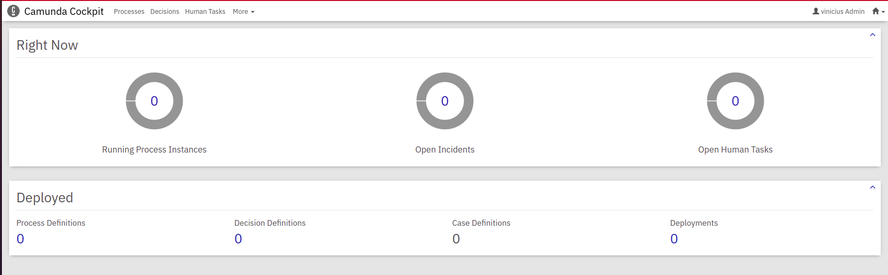

# Camunda Engine Cockpit

## Objetivo

A aplicação oferece uma visão em tempo real dos processos BPMN e tabelas de decisão DMN à medida que são executados, para que você possa monitorar seu status e identificar rapidamente incidentes técnicos que retardam ou interrompem os fluxos de trabalho.

## Documentação da Aplicação

Acesse o link da documentação [Swagger] (http://localhost:8080/webjars/swagger-ui/3.1.4/index.html?docExpansion=false&url=/swagger.json)

## Features

- [x] Configuração banco de dados MYSQL
- [x] Configuração Swagger

## Versionamento

Versão | Descrição
--------- | ------
release-candidate-1.0.0 | Configuração banco de dados MYSQL
release-candidate-1.0.1 | Configuração swagger

## Tecnologias Utilizadas

As seguintes ferramentas foram usadas na construção do projeto:

- [JDK 11](https://google.com)
- [Intellij](https://google.com)
- [Docker](https://google.com)
- [Maven](https://google.com)


## Como rodar a aplicação

1 - Execute o arquivo docker-compose.yml na raiz do projeto em seu terminal bash, para subir o container do Mysql, após isso você pode acessar o banco de dados da aplicção, utilizando alguma interface gráfica, as configurações do banco, estão dentro do arquivo docker-compose.
```
docker-compose up -d
```

2 - Abra o projeto na sua IDE de preferência e instale as dependências da aplicação e execute.

3 - Ao rodar a aplicação, você pode acessar a url: http://localhost:8080 e logar no cockpit com o usuário e senha: admin, que está configurado no arquivo aplication.properties dentro da pasta "src/main/resources".

Por fim você tera a visualização abaixo:


